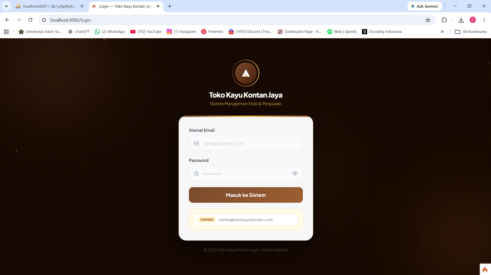
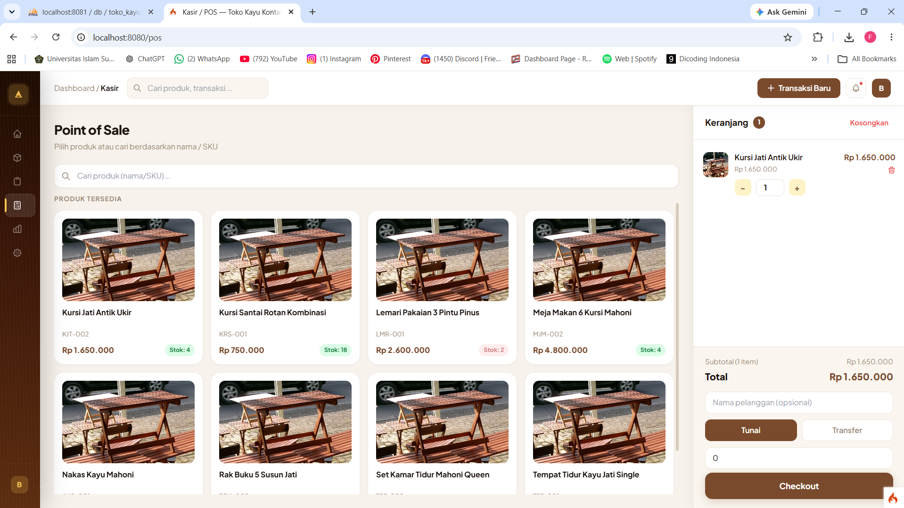
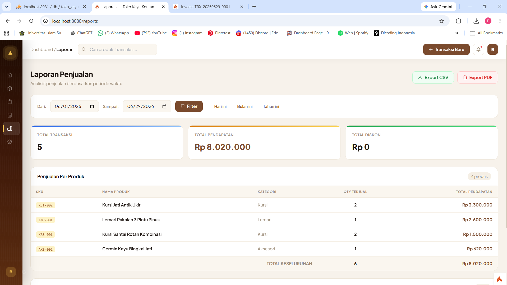

# SIM Toko Kayu Kontan Jaya

Sistem informasi penjualan dan manajemen inventori berbasis web untuk membantu
UMKM Toko Kayu Kontan Jaya mengelola operasional toko secara lebih terstruktur.

## Latar belakang

Sebelum sistem dikembangkan, pencatatan stok, transaksi penjualan, dan rekap
laporan masih dilakukan menggunakan buku serta nota tulis tangan. Proses ini
menyulitkan pemantauan stok, meningkatkan risiko selisih data, dan memperlambat
penyusunan laporan.

Kebutuhan sistem dikumpulkan melalui observasi alur kerja toko dan wawancara
dengan pemilik serta karyawan. Hasilnya diterjemahkan menjadi modul autentikasi,
produk, inventori, POS, transaksi, laporan, pengaturan, dan REST API.

## Peran dan kontribusi

**Akhmad Syaifudin — Full-Stack Web Developer / Pengembang Utama**

Memimpin implementasi teknis aplikasi web secara end-to-end, termasuk integrasi
antarmodul, perancangan database, implementasi fitur, pengujian, debugging, dan
penyempurnaan sistem.

Proyek dikembangkan secara kolaboratif bersama **Fani Agustina** dan
**Fahrul Alamsyah**, yang berkontribusi dalam analisis kebutuhan, perancangan
alur sistem, dukungan implementasi, evaluasi, pengujian fungsional, dan
dokumentasi.

## Fitur utama

- Role-based access untuk owner, admin, dan cashier.
- Dashboard ringkasan penjualan, tren transaksi, produk terlaris, dan stok rendah.
- Manajemen produk dan kategori.
- Pencatatan stok masuk, stok keluar, dan riwayat pergerakan stok.
- Analisis Reorder Point (ROP) untuk membantu perencanaan persediaan.
- Point of Sale dengan keranjang, checkout, invoice, dan pembaruan stok.
- Laporan penjualan dengan ekspor CSV dan PDF.
- REST API untuk produk, transaksi, inventori, dan data dashboard.

### Catatan teknis

Proses checkout menjaga konsistensi persediaan menggunakan transaksi database
dan row locking (`SELECT ... FOR UPDATE`) ketika menangani transaksi bersamaan.
API disediakan sebagai lapisan integrasi aplikasi, tanpa mengekspos detail
endpoint atau konfigurasi operasional pada showcase ini.

## Hasil dan pengujian

Sistem diuji menggunakan Black Box Testing pada skenario utama autentikasi,
produk, inventori, checkout, transaksi, dan laporan. Hasil pengujian mendukung
bahwa sistem dapat menyediakan pencatatan stok terintegrasi, peringatan ROP,
nota transaksi, dan laporan penjualan untuk kebutuhan operasional mitra.

## Screenshot aplikasi

| Modul | Preview |
| --- | --- |
| Login |  |
| Dashboard |  |
| Inventori & ROP |  |
| POS / Kasir |  |
| Transaksi & invoice |  |
| Laporan |  |

## Tech stack

- PHP
- CodeIgniter 4
- MySQL
- Apache
- REST API
- PHPUnit

Dokumentasi arsitektur tingkat tinggi tersedia di
[docs/architecture.md](docs/architecture.md).
